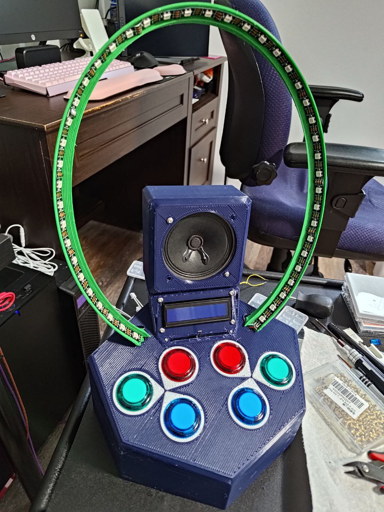

# rhythm-machine

Arcade style rhythm game powered by the RP2040 microprocessor.

## Materials

Most links below are to Adafruit. None are affiliate links.

- 1x [Raspberry Pi Pico](https://www.adafruit.com/product/4864)
- 1x [3 inch, 3 watt speaker](https://www.adafruit.com/product/1314)
- 6x [Arcade buttons](https://www.adafruit.com/product/473)
  - Note: Get 2 of 3 different colors; Red + Green + Blue
- 6x [Quick-connect JST cables](https://www.adafruit.com/product/1152)
  - Note: The link is to a pack of 10, so just one pack will be sufficient.
- 6x [2-Pin JST-XH connectors](https://www.digikey.com/en/products/detail/jst-sales-america-inc/B2B-XH-A-LF-SN/1651045)
- 1x [Micro SD card slot breakout board](https://www.adafruit.com/product/4682)
  - [Bulk alternative](https://www.amazon.com/gp/product/B0989SM146/)
- 1x [Micro SD card](https://www.amazon.com/SanDisk-COMINU024966-16GB-microSD-Card/dp/B004KSMXVM/)
  - Note: Avoid overpaying for these for projects. I'd recommend getting [a pack of 10 cards](https://www.amazon.com/dp/B0876H387X) between 8 and 32 GB.
- 1x [Class D audio amp](https://www.adafruit.com/product/2130)
- 1x [1602 LCD with 3.3v I2C adapter](https://www.amazon.com/gp/product/B08MPTND1V/)
  - Note: You can buy these pre-soldered, but you'll need to trim the pins down which may damage your wire cutters. I'd recommend getting some [cheap disposable ones](https://www.amazon.com/Hakko-CHP-170-Micro-Cutter/dp/B00FZPDG1K/) for this purpose.
- 45x [WS2812 addressable RGB LEDs](https://www.amazon.com/gp/product/B088BRY2SH/)
  - Note: Only 44 will be visible, but I'm using one as a makeshift logic level shifter.
- 1x Zener diode
  - [Various diode pack](https://www.amazon.com/EEEEE-Assortment-Rectifier-Recovery-Switching/dp/B08SBTS2KZ/)
  - This is only necessary if you're using one of the LEDs as a makeshift logic level shifter. If you have a dedicated logic level shifter, this isn't necessary
- 1x [75mm 10 kOhm Linear Slide Potentiometer](https://www.amazon.com/dp/B09NX39NWR?psc=1&ref=ppx_yo2ov_dt_b_product_details)
- 1x 47uF capacitor
  - [Electrolytic capacitor pack](https://www.amazon.com/BOJACK-Electrolytic-Capacitor-Assortment-0-1uF－1000uF/dp/B07PBQXQNQ/)
- 1x 10nF capacitor
  - [Ceramic capacitor pack](https://www.amazon.com/DYWISHKEY-Monolithic-Multilayer-Capacitors-0-1uF-100nF/dp/B07QGDGGZV/)
- 1x 100 Ohm resistor
- 1x 220 Ohm resistor
- 1x 1.8 kOhm resistor
  - [Resistor pack](https://www.amazon.com/BOJACK-Values-Resistor-Resistors-Assortment/dp/B08FD1XVL6/)
- 4x M3 6mm screws
- 4x M3 8mm screws
- 8x M3 nuts
- 2x M3 heat-set inserts
- 2x M2 8mm screws
  - For the above assembly hardware, I'd highly recommend just searching around for a kit. There are many options that offer different screw sizes, heads, bits, etc.

