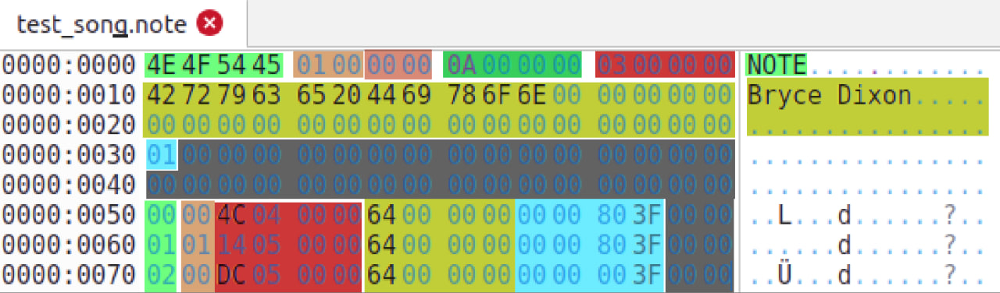

# rhythm-machine

## Assets

Playable songs are placed on the SD card in the following file structure:

- /
  - (Song Name)/
    - song.wav
    - song.note
  - (Song Name)/
    - song.wav
    - song.note

### 'song.wav' files

Contains the audio to be played during the song.

- Sampling rate: 22000Hz

- Format: 8-bit unsigned PCM

## 'song.note' files

Contains the information for when notes should be hit and how fast they travel.

- Header Data
  - "NOTE" identifier
  - File major version
  - File minor version
  - Milliseconds per pixel
  - Notes in the song
  - Author name
  - Difficulty (1-10)
  - 31 bytes of padding
- Note data (duplicated for each note)
  - Color (red, green, or blue)
  - Direction (left or right)
  - Start time (ms)
  - Length (ms; 0 is no hold)
  - Speed (float; 1.0 is normal speed)
  - 2 bytes padding for the pretty alignment
